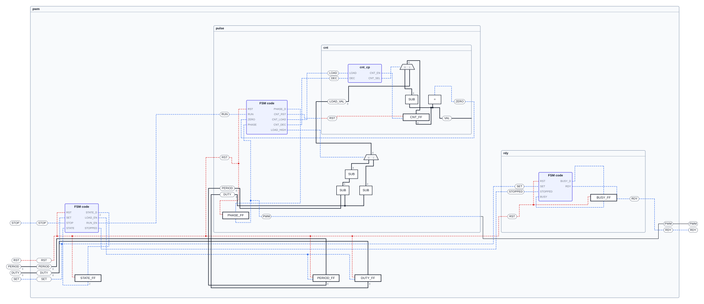
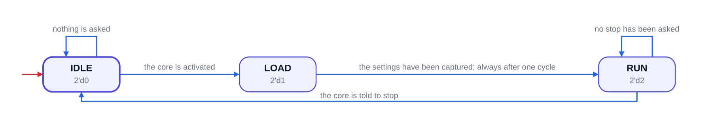
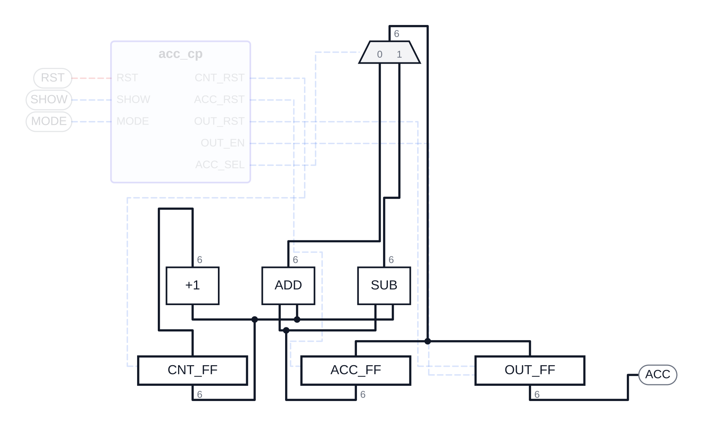

<p align="center">
  
</p>

<p align="center">
  
  
  
</p>

---

<p align="center"><b>Turn an existing RTL project into the schematic you would have drawn on a whiteboard.</b></p>

Point an AI agent (Claude Code, Codex, Cursor) at a Verilog folder and it reads the code and writes
the graph itself — one file per component, every box and every net carrying the line of code it came
from. Prefer to draw it yourself? Write the JSON by hand and use the same canvas, no agent required.

<p align="center"><b>Not a netlist viewer. The picture a person draws to explain the design — and every line of it traces back to the code, and to the brief the design was asked for.</b></p>

---

## A Quick Look

<p align="center">
  
</p>
<p align="center"><b><code>demo/pwm</code>, three levels of components open at once — each frame is its own file, and every box opens the Verilog it came from</b></p>

**Getting there takes four steps:**
1. Build the extension and press **F5** (see [Installation](#installation) — it is not on the Marketplace yet)
2. Right-click your RTL folder and run `RTLGraph: Copy Agent Spec to Workspace`
3. Paste the generated `.prompt/rtlgraph/english.md` (or `korean.md`) into your agent, filling in the project path
4. Open the finished `<top>.rtlgraph.json`

---

## Perfect for

- **Explaining a design you did not write**, by reading its shape before its syntax
- **Assignments handed out as a skeleton**, where the folder may not be touched and the brief is a PDF — the JSON sits beside the code and every box can open the sentence it exists for
- **Figures for a report or slides**, since any view exports to SVG, PNG or PDF cropped to what is on screen
- **The tables the design was built from**, since a schematic exports to XLSX: control signals, truth tables, state transitions
- **Checking an agent's reading of your RTL**, because every claim carries a `file:line` and the validator says when it does not match

---

## Motivation

Vivado will draw an elaborated schematic, and it is unreadable: every net, every hierarchy level, laid
out by a tool that has no idea which parts matter. The picture a person draws on a whiteboard is a
different object — a dozen boxes, the data path across, the control path underneath, the state machine
in a corner — and there is no tool that keeps *that* picture beside the code.

So the drawing is kept as **data**: a small JSON per component, which an agent writes by reading the
RTL. That makes the picture reviewable (it is a diff), regenerable (re-run the agent after a
refactor), and checkable — `origin` on every box and net names the file and line it came from, and the
validator reads the Verilog back to confirm the line really says that. An agent that invents a
connection is caught by the same pass that would catch a typo.

The hand still matters, so everything you arrange — moving a box, resizing a frame, bending a wire,
cutting a link, drawing one the code does not have yet — is written under `layout` and nowhere else.
Re-extraction never overwrites it. A link you draw that the RTL has no net for is drawn amber and
listed as an open goal, the way a proof assistant lists what is left to prove: the sketch says what the
code should do, and the panel keeps asking until it does.

And an assignment arrives as a PDF. The root names it once in `source.spec` and every file below
inherits it, so any box in the design can open the brief; a box that also quotes a sentence opens it
*inside the editor* with that sentence highlighted, so "does the circuit do what was asked" is one
click rather than a memory test.

---

## Screenshots

<p align="center">
  
</p>
<p align="center"><b>A <code>*.rtlgraph-fsm.json</code> opens as a state diagram — every transition says <i>when</i> it is taken, in words, with the code's own condition kept beside it</b></p>

<p align="center">
  
</p>
<p align="center"><b>The same kind of file under the <b>Datapath</b> preset — the filter is two levels deep, so the control path can be taken out of the picture entirely</b></p>

---

## Features

| | |
|---|---|
| **Component hierarchy** | One root plus a schematic per component, each beside the code it describes; fold a frame to a box, or open three levels at once. Opening a box shows one level — what is inside it always starts folded, so the same box always opens to the same picture |
| **Two-level filter** | **Comb** opens Data / Control, **Seq** opens Registers / FSM — the way a top module is drawn on a slide — plus presets (Datapath, Control path, Registers only…) |
| **Code jump** | Right-click any box or net to open the exact `file:line` it came from, in the editor group to the right of the drawing |
| **Requirement jump** | Right-click to open the brief the design was asked for, in pdf.js's own viewer — sidebar, find bar, zoom, print — with the quoted sentence highlighted. It is located by the sentence, never by stored coordinates, so it is still found when the document has been re-issued |
| **Hand editing that survives** | Move boxes and frames, resize, bend wires, cut a link, draw one the code lacks; all of it lives under `layout` and re-extraction leaves it alone |
| **Open goals** | A link the RTL has no net for is drawn dashed and listed conclusion-first ("Drive CNT_FF:D — nothing does yet"), so the sketch can run ahead of the code |
| **State machines** | `*.rtlgraph-fsm.json` draws Moore or Mealy as a diagram with the transition table beside it |
| **Export** | SVG / PNG / PDF of exactly what is on screen, and XLSX of the tables behind it — all written without a dependency |
| **Validator** | Schema, widths, ports, unreachable nets, missing `meaning`, and every `origin` checked against the Verilog itself. A `source.root` pointing at the wrong folder is reported once, with the value it should have, instead of once per element |
| **Its own file icon** | RTLGraph marks the tabs it owns — the schematic, the state diagram, the requirement reader — whichever icon theme you use. In the Explorer the icon belongs to your theme; `RTLGraph: Mark RTLGraph Files in the Explorer` teaches Material Icon Theme about them |
| **Agent-friendly** | `.agent/RTLGRAPH_SPEC.md` plus five ready-to-paste prompts, one per kind of job |

---

## Agent / AI Editing

> **Before pointing an agent at a project, run `RTLGraph: Copy Agent Spec to Workspace` once** —
> right-click the folder in the Explorer (or run it from the Command Palette). It writes, into that
> folder and nowhere else:
>
> ```
> .agent/RTLGRAPH_SPEC.md        how to turn RTL into *.rtlgraph.json (and how to write RTL)
> .agent/ENVIRONMENT.md          which simulators and tools this machine has
> .agent/rtlgraph-validate.mjs   the validator the agent runs on what it wrote
> .prompt/rtlgraph/{korean,english}.md     existing RTL → RTLGraph
> .prompt/assignment/{korean,english}.md   the same, for a skeleton that may not be touched
> .prompt/rtl/{korean,english}.md          spec → RTL in the three-layer layout, then RTLGraph
> .prompt/refactor/{korean,english}.md     existing RTL → restructured RTL, then RTLGraph
> .prompt/spec/{korean,english}.md         an idea → SPEC.md
> .prompt/README.md, README.korean.md     which of the five to reach for — for you, not the agent
> .base/{DFF,INC,ADD,SUB,MUX2,CMP_EQ}.v    the primitives RTLGraph draws with symbols, plus a note
> ```
>
> `.base/` is copied, not referenced: a handed-out skeleton often instantiates `DFF` without
> shipping one, and a project that cannot elaborate on its own is not much of a project. Point
> `source.lib` at it. If the code's primitive differs from the stock one — the UART assignment's
> `DFF` takes `BITWIDTH`, the width, where ours takes `BW`, the top bit index — adapt the copy and
> say so; RTLGraph still draws it as a register and reads its width from the nets.
>
> **Which prompt.** `.prompt/README.md` answers that in one table and a page per branch — it is
> written for a person deciding, not for an agent. In short: `rtlgraph` and `assignment` both leave
> the code exactly as it is; they differ in where the JSON goes. `rtlgraph` builds the contract layout (a folder per component) — use it on your
> own projects. `assignment` creates no folder: each JSON sits beside the module it describes
> (`demo/hw`), or set `RTLGRAPH_FOLDER` in the prompt and they all go in one folder of their own
> (`demo/lab`, code left in `src/`). `refactor` is the only one that restructures code, and it is a
> separate task on purpose. `RTLGraph: Copy Prompt Path` puts the path of whichever branch you want on
> the clipboard.

Key rules the spec holds the agent to:

- Every node and net carries `origin` (`file`, 1-based `line`) — **the validator reads the line back**, so a guess is caught
- `meaning` is **required on every control and reset net**: what happens when it is asserted cannot be read off the picture, and the control table and the workbook are built from it
- A state machine is a file of its own, and every state says what the design is *doing* there, every transition *when* it is taken — in words, with the code's condition kept beside it
- Where a brief exists, `source.spec` names the document and an element quotes the sentence **verbatim**; a requirement the design does not implement is a diagnostic, not a quote
- `layout` is the reader's, never the agent's: rewriting the graph leaves the arrangement alone

### Example prompt

After running `RTLGraph: Copy Agent Spec to Workspace` on your project folder, paste this in — the same
text is written out as `.prompt/rtlgraph/english.md`, so you can hand the agent that path instead.

```
PROJECT_FOLDER = <ABSOLUTE PATH TO THE RTL PROJECT>

PROJECT_FOLDER/.agent/RTLGRAPH_SPEC.md and PROJECT_FOLDER/.agent/ENVIRONMENT.md
are already prepared for you — read both in full.

Read the RTL without changing it, then write the root <top>.rtlgraph.json and
one *.rtlgraph-schematic.json per component, following the spec exactly.
Every node and net must carry the file and line it came from.

Run PROJECT_FOLDER/.agent/rtlgraph-validate.mjs on the result and fix what it
reports, until it is clean. Tell me when done.
```

### An assignment with a PDF brief

Assignments are what the `assignment` prompt exists for: the skeleton's folders and names may not be
touched, so nothing is moved and each JSON is written beside the module it describes. Give the agent
the handout as well and it fills in `source.spec` plus a `spec: { quote, page }` on the elements the
document actually talks about. Right-clicking one of those opens the PDF beside the drawing with that
sentence highlighted; any other box in the same design offers the brief itself. `demo/hw` is the worked
example, handout included.

---

## Mouse & Keyboard

### Canvas

| | |
|---|---|
| Drag | Pan |
| Scroll | Zoom |
| Click | Select a box, a frame or a wire |
| Double-click a component | Fold or unfold just that one |
| Right-click a box or net | Where to go: the schematic inside it, its code, its requirement |
| `Esc` | Deselect |

### Edit mode

| | |
|---|---|
| Drag a box or frame | Move it |
| Drag a frame's corner | Resize it |
| Drag a straight run of a wire | Shift that run sideways |
| Drag from a pin | Draw a link — drop it on a pin, or anywhere over the target box and it snaps to the nearest pin that can take it; while you drag, only the pins that can take it stay lit |
| Right-click a wire | Flip the nearest corner: an `L` becomes a `Γ` and back. A wire only ever turns at right angles, so two runs meeting at a corner span a rectangle and there are exactly two ways round it — right-clicking swaps them, and right-clicking again puts it back. The editor says which wire it turned; a wire that runs straight has no corner and says so |
| `Delete` | Cut the selected link (drawing it again puts it back) |

Everything here is written under `layout` in the file, and nothing else is.

---

## Installation

RTLGraph is not on the Marketplace yet. To run it from source:

```bash
git clone https://github.com/Jeong-jin-Han/RTLGraph
cd RTLGraph
npm install
npm run check      # typecheck + tests; also builds the extension bundles
```

Open the repository in VS Code and press **F5** (**Run RTLGraph**). An *Extension Development Host*
opens on `demo/`; try `acc/acc_top.rtlgraph.json` or `pwm/pwm_top.rtlgraph.json`.

Node ≥ 22.18 is required — the packages are TypeScript sources, run directly.

### File icons

The tab of anything RTLGraph draws carries its mark already: the editor owns its
own tab, so it sets the icon whatever theme you use. The Explorer is a different
matter. That icon comes from your file icon theme; RTLGraph contributes a
`rtlgraph` language (JSON's grammar, unchanged, so highlighting survives) which
the default theme falls back to, but a theme that resolves by extension —
Material Icon Theme, say — sees `.json` and draws braces before ever asking.
Run `RTLGraph: Mark RTLGraph Files in the Explorer` and it offers to add the three
patterns to Material's associations (it asks first; it is your settings file). On
the default theme nothing is needed — RTLGraph's own icon is used there.

---

## Files

One root per project and one schematic per component, each next to the code it describes:

```
<project>/
├── <top>.rtlgraph.json                       root: the top's ports and component boxes, no logic
└── <main>/                                   the main component — a folder even when it is the only one
    ├── comb/  seq/  tb/
    ├── <main>.rtlgraph-schematic.json        its schematic; a component inside it is a box that refers to…
    ├── <main>.rtlgraph-fsm.json              …and, if it runs a machine, the machine
    └── <child>/<child>.rtlgraph-schematic.json   …its own schematic, and so on
```

The **FSM** and **Schematic** buttons walk between a component and its machine. Fold state is
remembered per file by VS Code, never written into the JSON.

The shape of a schematic file:

```jsonc
{
  "version": "0.1.0", "kind": "component", "title": "cnt",
  "source": { "root": ".", "spec": "../spec/brief.pdf", "files": ["seq/cnt_top.v"], "top": "cnt_top" },
  "signals": {
    "CNT_EN": { "width": 1, "flow": "control", "driver": "control_path:CNT_EN", "sinks": ["CNT_FF:EN"],
                "meaning": "1=the counter register takes a new value",
                "origin": { "file": "seq/cnt_top.v", "line": 19 } }
  },
  "nodes": {
    "CNT_FF": { "kind": "reg", "flow": "data", "time": "seq", "module": "DFF",
                "ports": { "CLK": "in", "RST": "in", "EN": "in", "D": "in", "Q": "out" },
                "spec": { "quote": "Count up while EN is high.", "page": 1 },
                "origin": { "file": "seq/cnt_top.v", "line": 22 } }
  },
  "layout": { "nodes": { "CNT_FF": { "x": 240, "y": 120 } } }   // the reader's, never rewritten
}
```

See `.agent/RTLGRAPH_SPEC.md` (or `packages/vscode-ext/assets/agent/RTLGRAPH_SPEC.md`) for the whole
schema, and `docs/DECISIONS.md` for why each part is the way it is.

---

## Export

**Export…** writes what is on screen — the current filter and fold state, cropped to what is visible —
next to the graph file:

```
acc/acc_top.rtlgraph.json
acc/.out-acc_top/acc_top.datapath.svg   vector; Inkscape, Illustrator, web pages
acc/.out-acc_top/acc_top.datapath.png   2× image; slides, chat
acc/.out-acc_top/acc_top.datapath.pdf   vector; papers, reports
acc/.out-acc_top/acc_top.control.xlsx   the tables behind it; Excel, LibreOffice
```

**XLSX** is the drawing read back as the tables it was made from — one tab of control signals per level
(what drives each, what reads it, what it means), one tab per truth table, and, where a brief is cited,
one tab of requirements against what carries each. A `*.rtlgraph-fsm.json` gives the machine, its
states and every transition.

A figure holds the schematic and nothing else: fold markers stay in the editor, and a root that only
wraps one main component is left out. The file name carries the view (`all`, `datapath`, `controlpath`,
`comb`, `registers`, `fsm`, or the groups spelled out). The folder is the `rtlgraph.export.folder`
setting, default `.out-${name}` — hidden, like NodeGraph's `.<name>-imgs`.

PDF text uses the built-in Helvetica font, so non-Latin labels (e.g. Hangul) come out as `?` there —
you are warned, and SVG/PNG show them correctly.

Without VS Code:

```bash
node packages/rtl-render/src/cli.ts <graph> datapath --unfold --format pdf -o out.pdf
node packages/vscode-ext/dist/agent/rtlgraph-validate.mjs <graph>
```

---

## Commands

`Ctrl+Shift+P` → type `RTLGraph`:

| Command | What it does |
|---|---|
| `RTLGraph: Copy Agent Spec to Workspace` | Writes the agent files into a folder (also on folder right-click in the Explorer) |
| `RTLGraph: Copy Prompt Path` | Pick a branch of work; its `.prompt/…md` path goes to the clipboard |
| `RTLGraph: Mark RTLGraph Files in the Explorer` | Teaches Material Icon Theme about `*.rtlgraph.json` (asks before touching your settings) |
| `RTLGraph: Export Schematic (SVG / PNG / PDF)` | Exports the current view (also the **Export…** toolbar button) |
| `RTLGraph: Fold Components` / `Unfold Components` | The selected component — on its own (what is inside goes back to folded) or with everything inside — else the whole hierarchy |
| `RTLGraph: Open Component Schematic` | Opens the selected component's own schematic file |
| `RTLGraph: Open the Code of the Selected Box` | Jumps to the `origin` line, in the editor group right of the schematic |
| `RTLGraph: Open the Requirement of the Selected Box` | Opens the brief in the reader, with the quoted sentence highlighted |
| `RTLGraph: Open State Machine` / `Open the Component Schematic` | Walks between a component and its machine |
| `RTLGraph: Back Out of This Schematic` | Up one level to the component this one sits inside, or out to the root — the **Prev** button asks which |
| `RTLGraph: Open Root File` | Straight out to the root of the hierarchy |
| `RTLGraph: Set View Preset` | All · Datapath · Control path · Combinational only · Registers only · State registers only |
| `RTLGraph: Fit View` | Fit the schematic to the window |

---

## Repository layout

| Path | What |
|---|---|
| `packages/rtl-ir` | IR types, validator, source cross-check, layout merge, view filter — no VS Code, no dependencies |
| `packages/rtl-registry` | Symbols for the `base/` primitives, width and port checks |
| `packages/rtl-layout` | Row-based placement and orthogonal wire routing |
| `packages/rtl-render` | IR → SVG and PDF, shared by the editor and the CLI |
| `packages/rtl-sheet` | IR → XLSX: control signals, truth tables, a machine's transitions |
| `packages/rtl-pdf` | Finding a quoted sentence on a page of a PDF, and the boxes to paint over it |
| `packages/vscode-ext` | The extension: custom editor, requirement reader, commands, agent spec and prompts |
| `demo/acc` | D01-2 accumulator: root, main component `acc/`, golden SVGs |
| `demo/base` | Shared primitives (`DFF INC ADD SUB MUX2 CMP_EQ`) |
| `demo/pwm` | D02-2 PWM controller: three levels, three state machines, a one-page brief |
| `demo/hw` | An assignment skeleton: one flat folder, JSON beside the code, handout included |
| `demo/lab` | The same idea, files kept together: code in `src/`, every JSON in `rtlgraph/` |
| `demo/sys` | Three levels of hierarchy — the case for folding, and the render golden |
| `demo/updown`, `demo/stopwatch` | Written end to end by an agent, and deliberately non-conforming student code |
| `packages/vscode-ext/assets/pdfjs-viewer` | Mozilla's PDF viewer, mounted whole (Apache-2.0, licence beside it) |
| `LICENSE`, `docs/THIRD-PARTY.md` | MIT, and what is shipped inside the extension under what terms |
| `docs/DECISIONS.md` | Schema, layout, filter, editor and agent decisions, with the reason for each |
| `tools/logo.py` | Makes the icon and banner from the drawn logo (run by hand; the PNGs are committed) |

Only `packages/vscode-ext` imports `vscode`.

---

## Develop

```bash
npm run check    # tsc typecheck + node --test
npm run golden   # regenerate the golden SVGs after an intended visual change

# end-to-end in a real VS Code with a throwaway profile, off screen
VSCODE_EXECUTABLE=/usr/share/code/code xvfb-run -a npm run e2e
```

Every demo also simulates, and every demo project validates with no errors and no warnings — both are
checked by the test suite.

---

## Tech Stack

- **TypeScript, run directly** by Node ≥ 22.18's type stripping — no build step for the packages, `node --test` for the tests
- **esbuild** for the two webview bundles and the extension-host bundle
- **No runtime dependencies.** The SVG, PDF and XLSX writers are all ours — a PDF is a Scene of text and lines, an XLSX is a stored zip of XML parts
- **pdf.js's reference viewer**, mounted whole for the requirement reader (`packages/vscode-ext/assets/pdfjs-viewer`, Apache-2.0); the sentence itself is located by our own matcher in `packages/rtl-pdf` and handed to the viewer's find controller
- **Verified against real tools**: iverilog simulates every demo, LibreOffice and `pdftotext` read the exports back, and the end-to-end suite drives a real VS Code

---

## Privacy

Everything runs locally. The extension makes no network requests: it reads the JSON, the Verilog beside
it, and the documents you point it at. What an AI agent does with your code is between you and that
agent — RTLGraph only reads the files it wrote.

---

## License

MIT — see [LICENSE](LICENSE).

What is shipped *inside* the extension is written down in
**[docs/THIRD-PARTY.md](docs/THIRD-PARTY.md)**: the requirement reader is Mozilla's
pdf.js viewer, Apache-2.0, mounted whole with its licence text beside it. That
licence is compatible with this one; nothing else is bundled.

The sibling of [NodeGraph](https://github.com/Jeong-jin-Han/NodeGraph), with
Verilog instead of papers as input.
